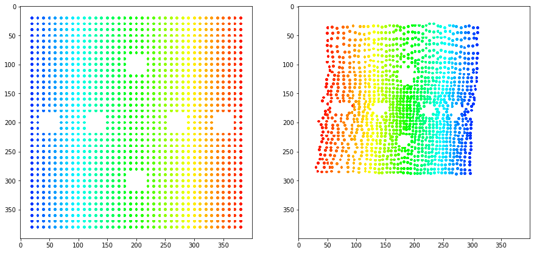
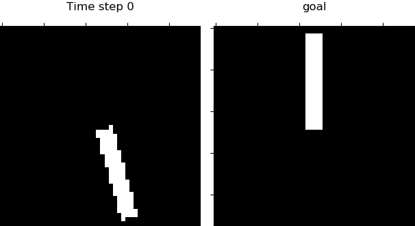

## Prediction, Consistency and Curvature

This is a pytorch implementation of the paper "[Prediction, Consistency, Curvature: Representation Learning for Locally-Linear Control](https://arxiv.org/abs/1909.01506)".

**Note: This is not the official implementation.**

## Installing

First, clone the repository:

```
git clone https://github.com/tungnd1705/PCC-pytorch.git
```

Then install the dependencies as listed in `pcc.yml` and activate the environment:

```
conda env create -f pcc.yml

conda activate pcc
```

## Simulate training data

Currently the code supports simulating 3 environments: `planar`, `pendulum` and `cartpole`. The MDP for `pendulum` and `cartpole` is borrowed from Yinlam's code.

In order to generate data, simply run:
```
cd data

python sample_{env_name}_data.py --sample_size={sample_size}
```

The raw data (images) is saved in data/{env_name}/raw
<!-- For the planar task, we base on [this](https://github.com/ethanluoyc/e2c-pytorch) implementation and modify for our needs. -->

## Training

The code currently supports training for ``planar`` and ``pendulum`` environment. Run the ``train_pcc.py`` with your own settings. E.g.,

```
python train_pcc.py \
    --env=planar \
    --armotized=False \
    --log_dir=planar_1 \
    --seed=1 \
    --batch_size=128 \
    --lam_p=1.0 \
    --lam_c=8.0 \
    --lam_cur=8.0 \
    --vae_coeff=0.01 \
    --determ_coeff=0.3 \
    --lr=0.0005 \
    --decay=0.001 \
    --num_iter=5000 \
    --iter_save=1000
```

You can visualize the training process by running ``tensorboard --logdir={path_to_log_file}``, where ``path_to_log_file`` has the form ``logs/{env}/{log_dir}``. The trained model will be saved at ``result/{env}/{log_dir}``.

## Run iLQR on latent space

The configuration file for running iLQR for each task is in ``ilqr_config`` folder, you can modify with your own settings. Run ``python ilqr.py --task={task}``, where ``task`` is in ``{plane, swing, balance}``.

The code will run iLQR for all models trained for that task and compute some statistics. The result is saved in ``iLQR/result``.

## Result
We evaluate the PCC model in 2 ways: quality of the latent map and the percentage of time the agent spent in the goal region. 
### Planar system

#### Latent map
Below is a random latent map PCC produces. You can watch a video clip comparing how latent maps produced by E2C and PCC evolve at this link: https://www.youtube.com/watch?v=pBmzFvvE2bo.



#### Control result
We got around 41% on average and around 76% for the best model. Below are 2 sample trajectories of the agent.


### Inverted pendulum
We got around 50% on average and around 100% for the best model. Below are 2 sample trajectories of the inverted pendulum.




### Acknowledgment
Many thanks to Nir Levine for answering my questions about the paper, and Yinlam Chow for the MDP and iLQR implementation.

### Citation

If you find PCC useful in your research, please consider citing:

```
@techreport{48535,
title	= {Prediction, Consistency, Curvature: Representation Learning for Locally-Linear Control},
author	= {Nir Levine and Yinlam Chow and Rui Shu and Ang Li and Mohammad Ghavamzadeh and Hung Bui},
year	= {2019}
}
```